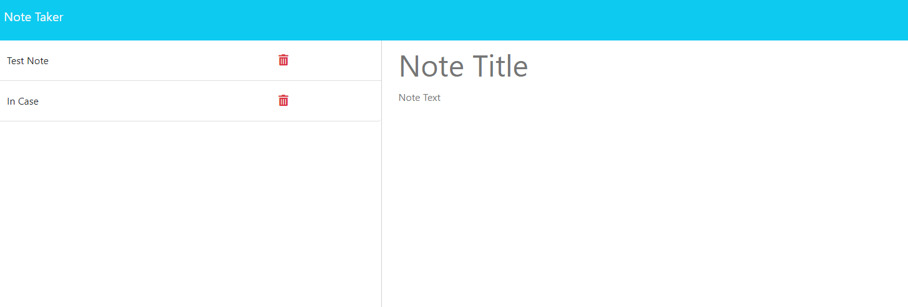

# Note Taker

## Description

An app that is designed to... take notes. In order to not forget upcoming appointments and plans this app allows you to write custom notes and save them.

## Table of Contents

- [Installation](#installation)
- [Usage](#usage)
- [License](#license)
- [Collaborators](#collaborators)
- [Contributing](#contributing)
- [Tests](#tests)
- [Questions](#questions)

## Installation

Open the terminal to /NoteTaker and run the command "npm i"

## Usage

This app is used to organize upcoming events or just for notes in general. You can even close the browser and when you bring it back up your notes will still be there. Just write a title and some text for your note, click the save button, and when you want to view it again click the option on the left.

## License

## Collaborators

No collaborators yet!

## Contributing

To contribute to this project, contact me using one of the methods below.

## Tests

To test, open your terminal to /NoteTaker. Then run the script npm run start. Open your browser to http://localhost:3001 and begin taking notes.

## Questions

If you have any questions do hesitate, but only a little, to contact me:

Github: https://github.com/PaulGibes?tab=repositories

Email: paulgibes@gmail.com
